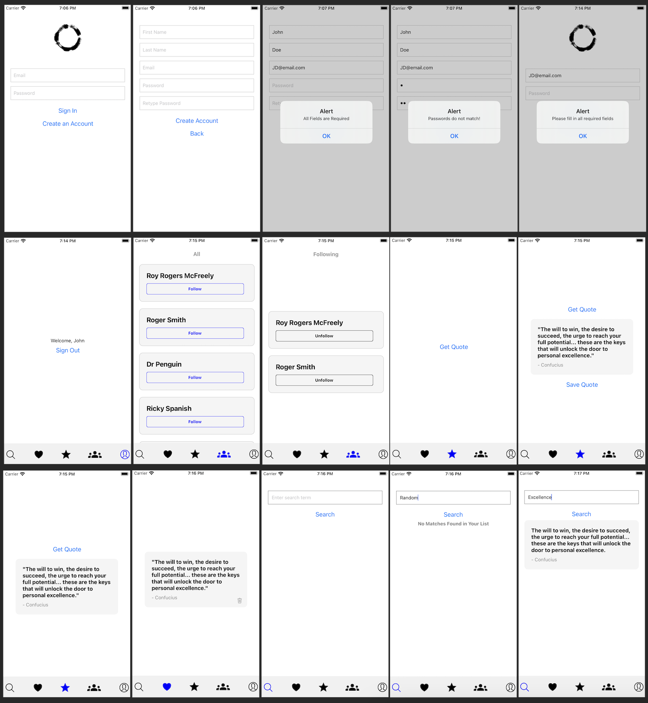

- npm install		-- Install dependencies
- node index.js		-- Start Backend	
- npm start		-- Start Front-End
- npm run coverage	-- Test coverage
- npm test 		-- Run tests	

** Note: JWT secret key is stored in a dotenv which is gitignored. See Canvas attachement for JWT secret key.

Proof of Concept
Description - I wanted to get exposure to Mobile Front-Backend integration, and so I decided to pursue a simple React Native Expo App that will have the following Page-Functionalities:
 - Sign In: Basic sign in page with Email/Password fields and a button for 'Sign In', and one for 'Create Account'
		-- Button 'Sign In': Does a POST request to 3000/signin with the provided info, if successful will land on the User page. If record is not found, will send an alert.
 - Sign Up: Basic sign up page with FirstName/LastName/Email/Password/PasswordAgain fields and a button for 'Create Account', and one for 'Go Back'
		-- Button 'Create Account': Presets the user with signup info (name, email, password...), if all prerequisites are met, will do a POST 3000/signup, after which it will land the user on the HomePage. Will throw alerts if email is taken, or another issue exists.
	- User Page: 
		-- (incomplete) Button 'Sign Out': If pressed signs the user out. Need to invalidate the token.
		-- (To be implemented) Button 'Change Password': If pressed signs the user will be able to change their login password.
	- Star Page:
		-- Button 'Get Quote': If pressed makes an api to 'https://api.quotable.io/' for a random quote. Displays it on the screen. Another button appears to 'Save Quote', if pressed an API call will be made to save the quote to the user's Id. 'Save Quote' disappears after the first press.
		-- Button 'Save Quote': Appears initially with the quote. If pressed, will POST 3000/quotes/ which will save the quote to the user list.
	- Fav Page: Shows the list of Saved Quotes
		-- Button 'Garbage Icon': Appears on every quote card. If pressed, will DELETE 3000/quotes/quoteId which will delete that quote from the user list.		
	- Search Page:
		-- Button 'Search' - If user provided a keyword or first/last name, will GET 3000/search/?q={searchTerm}. If metaScore is high enough, will display a result, else will display 'No Matches Found in Your List'

Completed:
	- Routes:
		-- signin.js:
			+ 'POST /' - Incorporated from Week5 HW, uses Bcrypt & JWT.
		-- signup.js
			+ 'POST /' - Incorporated from Week5 HW, uses Bcrypt & JWT.
		-- quotes.js
			+ 'POST /' requires AuthZ - Saves a liked quote to the user's list
			+ 'GET /' requires AuthZ - Grabs all liked quotes for a specific user
			+ 'DELETE /:quoteId' requires AuthZ - Removes a specific quotes from a user's list
		-- search.js
			+ 'GET /' - Leverages the metaScore search we learned about in class to find a saved quote in a user's saved list given a search term or Author first/last name. Will display 'No Matches Found in Your List' if no hits.
   	- DAO
		-- quotesDAO.js
  		+ userId: required
    		+ quoteId: unique, required
      		+ author: required, indexed
		+ content: required, indexed (Maybe someone plagiarized idk)
  		+ tags:
    		+ length:
      		+ dateAdded:
		-- userDAO.js
			+ firstName: required
			+ lastName: required
			+ email: unique
			+ hashedPassword: required
	- Models
		-- quotes.js
		-- user.js
	- Basic App Design with I/O fields: Mostly done, not concerned too much on esthetics 

Remaining - 
	- Testing: Although the App behaves linearly in the simulator, I have not started compiling my Jest tests. This is my current priority.
	- Finish token invalidation when user Signs off, and change password option.
	- Might do a add custom quote to User list if I have time.

Run it: 
	- npm start - boots the React Native Expo Front End
	- node index.js - boots the backend stuff
	- npm install - should install most dependencies, I might have forgot to --save a couple when installing them while composing the App, but console.errors will let you know what you are missing
