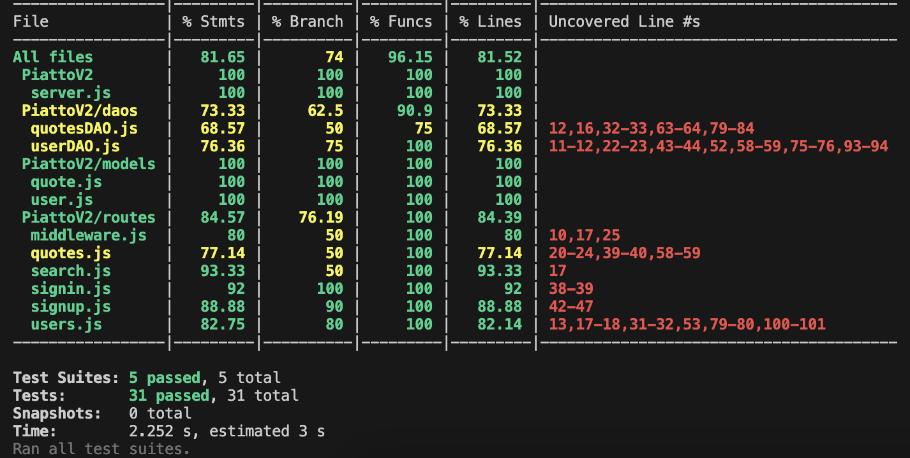

npm start			- Start Front-End
node index.js		- Start Backend		
npm run coverage	- Test coverage
npm test 			- Run tests

QuoteBox App

QuoteBox is a Mobile App developed in React Native with Expo. This App utilizes NodeJS and MongoDB as the backend, with JEST testing.

CRUD routes:
	Quotes:
	- POST '/quotes': Adds a quote to the db liked by the user
	- GET '/quotes': Returns all of user's liked quotes from the DB
	- DELETE '/quotes/:quoteId': Deletes a previously liked user's quote from the DB

	Users:
	- GET '/users': Retrieves the user from the DB
	- GET '/users/following': Retrieves user information the main user is following
	- GET '/users/not-following': Retrieves user information the main user is not following
	- POST '/users/follow': Adds user profile to follow list for main user
	- POST '/users/unfollow': Removes user profile from follow list for main user

	Search:
	- GET '/search': Takes provided search term, and using meta score search, will return any quotes that have a significant textScore as defined by Mongo. Else will display message.

	Signup:
	- POST '/signup': Takes provided firstName/lastName/email/password, checks if an email record exists, if not hashes password with bcrypt, and stores info in DB. Returns a minted JWT.

	Signin:
	- POST '/signin': Takes provided email/password, and compares bcrypt hashword, if valid returns a JWT token

Text Search:
	Search:
	- A Mongo text meta score search is utilized in this project to search for specific quotes given a search term. If a significant score is achieved, the search will return the quote(s) belonging to that user.

Indexing, Uniques:
	Users:
	- Emails must be unqiue

	Quotes:
	- Quotes are indexed for faster retrieval 

Self-Evaluation:
Overall I found this project enjoyable as well as challenging to develop. 
Starting a project from scratch, setting up the front and back end simultaneously, and then refining the code with tests, all in 3-4 weeks has definitely been a learning curve.
I took some inspiration from our HW assignments on the approach, data models, data access objects, and some routes.
To me, tying the backend to a virtual interface via an App definitely made the project more enjoyable, since I can interact with what I have learned in the past 10 weeks.

What went well was the integration and route composure. Sometimes there were issues with how you send data to the backend via Axios, more specifically the options that come with Axios, but after 10-20 minute with the docs & stackoverflow, the issues get quickly resolved. 
Test time outs and ghost behaviors (via front end) were another issue for me during the development of this project. Usually a small react state change, or (less-so) unexpected backend return that would tigger something unexpected. But that is where TDD shines, which leads me to my next point.

One area I am working to improve my skills are with TDD (Test Driven Development). 
My biggest weakness with TDD is setting up tests not knowing exactly how my function or route would work down in the small details. 
And sometimes I would have a test passing, but the UI is demonstrating failure, because the test was very vague, which would give me an illusion that it was complete, when in fact it needed more details, but not sure in the past what details to require during test composure. 
So it would boil down to jumping back and forth between the development environment (Front/Back end) and the test logs, until I chose to run with one, which was to get the app working via the Simulator, and then knowing more about the main structure & details of the code, I could build more specific test requirements.

Another area I plan to improve on is with GitHub actions, and building yml scripts that can auto test my files. I spent some time embedding secret keys and fiddling with the yml script, as well as importing them from our HW assignments, however I couldn't get them to work. Since it's not required, and I have >80% passing coverage, I deemed it sufficient to stop there and focus on polishing the files.

Well that is all I have. Thanks Joel for challenging us with this course, as a result I have learned alot, and am capable of developing fully functional Apps.

